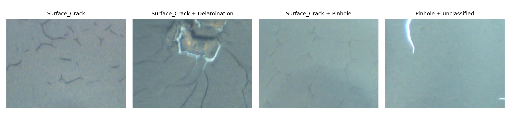
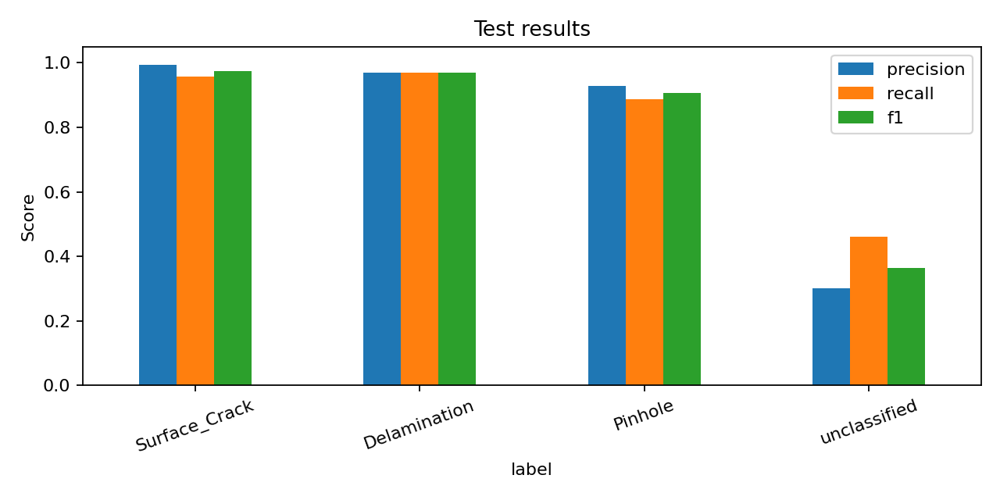

# Battery Coating Defect Classification

This is a small computer vision project for recognizing defects in battery
electrode coating images. One image can contain more than one defect, so the
model predicts four labels independently:

- surface crack
- delamination
- pinhole
- unclassified defect



## Dataset

I used the CoatingVision dataset. It has 2,227 classification images and is
available on [Kaggle](https://www.kaggle.com/datasets/vigneshirtt/li-ion-battery-coating-defect-dataset).
The dataset was published with this
[Scientific Data article](https://doi.org/10.1038/s41597-025-06419-1).

The images are not included in this repository. Download them with:

```powershell
python download_data.py
```

The script downloads the same dataset from the authors' official Figshare
upload because it does not require a Kaggle login.

## What I did

I fine-tuned a pretrained ResNet-18 and replaced its last layer with four
outputs. I used binary cross-entropy because the problem is multilabel. The
rare labels receive a larger weight during training.

The images are patches from larger camera frames. I split the data by original
frame instead of randomly splitting individual patches. This prevents similar
patches from the same frame from being in both the training and test sets.

The split is 70% training, 15% validation and 15% test. Thresholds are selected
with validation data and the test set is used once for the final result.

## Run the project

Install the packages:

```powershell
python -m pip install -r requirements.txt
```

Look at the dataset:

```powershell
python explore_data.py
```

Train the model:

```powershell
python training.py
```

Test one image:

```powershell
python predict.py data/raw/CoatingVision/classification/images/image_1.jpg
```

Training saves the model, the data split, test predictions and result graphs in
`model_output/`.

## Results

The model stopped after seven epochs. The final test set contained 331 images
from frames that were not used for training or validation.

| Metric | Result |
|---|---:|
| Micro F1 | 0.936 |
| Macro F1 | 0.804 |
| Macro average precision | 0.868 |

| Label | Precision | Recall | F1 | Positive test images |
|---|---:|---:|---:|---:|
| Surface crack | 0.993 | 0.957 | 0.975 | 282 |
| Delamination | 0.969 | 0.969 | 0.969 | 32 |
| Pinhole | 0.929 | 0.886 | 0.907 | 88 |
| Unclassified | 0.300 | 0.462 | 0.364 | 13 |



The unclassified category is clearly the weakest result. It has few examples
and it also does not describe one consistent visual defect.

## Limitations

- The rare `unclassified` label has only a small number of test examples.
- The model classifies a complete image and does not draw the defect location.
- Images from another camera or production line may look different.
